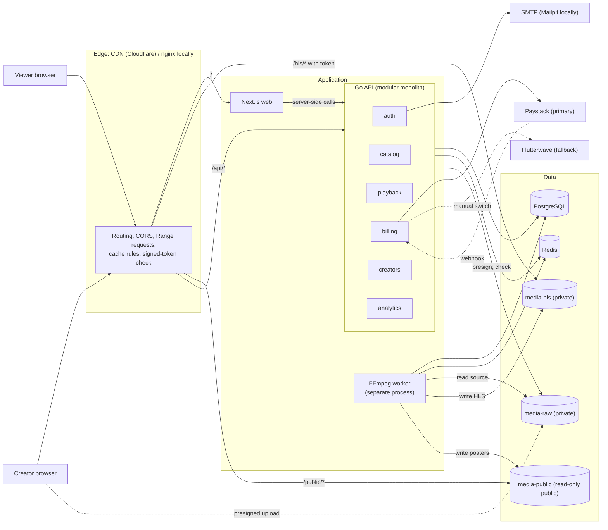
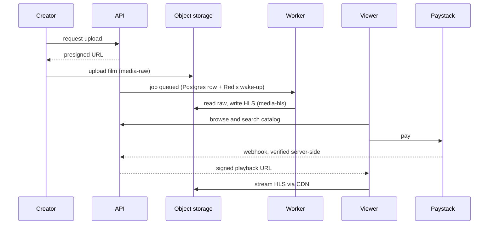

# Architecture

StreamAfrica is a web streaming MVP. The loop to prove: creator uploads a film, the platform turns it into HLS, a viewer finds it, watches it and pays. Decisions are recorded in [`adr/`](adr/README.md).

## Component diagram

## Product loop

## Rules that shape the code
- One modular monolith and one separate worker ([ADR-0004](adr/0004-modular-monolith-in-go.md), [ADR-0005](adr/0005-hls-delivery-and-ffmpeg-worker.md)).
- The app speaks plain S3. Media is private and reached only through signed tokens ([ADR-0006](adr/0006-s3-compatible-storage-and-signed-urls.md)).
- Configuration comes from environment variables only. Schema changes come from versioned up and down migrations.
- Mobile data first: adaptive bitrate starting at 240p and small payloads.

## Environment matrix

| Concern | Docker (local) | cPanel (smoke and demo only) | Standard cloud |
|---|---|---|---|
| Purpose | Daily development and tests | Show the front end to stakeholders | Staging and production |
| How it runs | `docker compose up` | Files uploaded through cPanel, no Docker | Containers from GHCR on a VPS |
| Web | Next.js dev server | Static export or cPanel Node app, pointed at a cloud staging API | Next.js standalone container |
| API | Go with hot reload | Not hosted here | Go container, replicas behind a proxy |
| FFmpeg worker | Yes | No (no FFmpeg, no long-running processes) | Yes, separate container, limited concurrency |
| PostgreSQL | Compose `postgres:16` | None (cPanel offers MySQL only, unused) | Managed Postgres, `sslmode=require`, backups |
| Redis | Compose container | None | Managed or container with password and persistence |
| Object storage | MinIO-compatible (ADR-0003) | None, reads media from the cloud CDN | Cloudflare R2 (or S3) |
| CDN | nginx on :8088 | Cloud CDN URL | Cloudflare in front of R2 |
| Email | Mailpit | None | Transactional email provider over SMTP |
| Payments | Paystack test keys | Test keys through staging API | Test keys in staging, live keys in production |
| TLS | None (localhost) | cPanel AutoSSL | Cloudflare or Let's Encrypt |
| Secrets | `.env`, gitignored | Public `NEXT_PUBLIC_*` values only | Secret manager or host environment |
| Data | Disposable | None | Persistent and backed up |

## Open items
- ADR-0008 (pricing) and ADR-0010 (licensing) are Proposed and need your decision.
- The home page renders on the server today. A cPanel static demo needs client-side fetching, so decide that when the demo is built.
- A local replacement for the MinIO mirror (SeaweedFS or Garage) is unapproved.
- `docker-compose.prod.yml` and the production safety check are not built yet.
